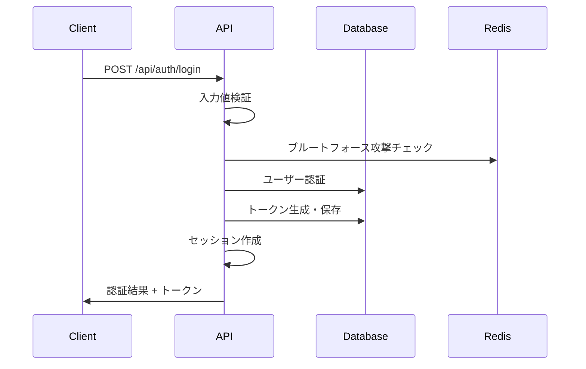
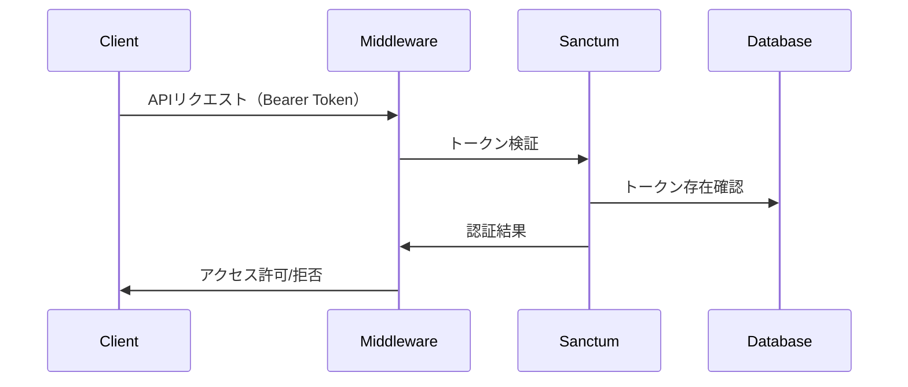

# 認証システム設計
## AI駆動開発調査プロジェクト - Web社員管理システム

**文書管理情報**
- 作成日: 2025-08-21
- バージョン: 1.0
- 作成者: AI駆動開発チーム
- 承認者: -
- 最終更新日: 2025-08-21

---

## 1. 認証システム概要

### 1.1. 認証方式
- **基本認証**: メールアドレス + パスワード
- **セッション管理**: Laravel Sanctum による SPA 認証
- **トークン方式**: Personal Access Tokens
- **セキュリティ機能**: アカウントロックアウト、パスワードポリシー

### 1.2. 技術構成
- **フレームワーク**: Laravel Sanctum
- **トークン管理**: データベースベース
- **セッション**: Cookie ベース（SPA）
- **パスワードハッシュ**: bcrypt

---

## 2. 認証フロー設計

### 2.1. ログインフロー


### 2.2. 認証チェックフロー


---

## 3. 認証実装

### 3.1. AuthService
```php
<?php

namespace App\Services;

use App\Models\User;
use Illuminate\Auth\AuthenticationException;
use Illuminate\Support\Facades\Auth;
use Illuminate\Support\Facades\Hash;
use Illuminate\Support\Facades\RateLimiter;
use Illuminate\Validation\ValidationException;

class AuthService
{
    private const MAX_ATTEMPTS = 5;
    private const DECAY_MINUTES = 15;

    /**
     * ログイン処理
     */
    public function login(array $credentials): array
    {
        $email = $credentials['email'];
        $password = $credentials['password'];
        
        // ブルートフォース攻撃対策
        $key = $this->getRateLimitKey($email);
        
        if (RateLimiter::tooManyAttempts($key, self::MAX_ATTEMPTS)) {
            $seconds = RateLimiter::availableIn($key);
            throw ValidationException::withMessages([
                'email' => ["アカウントがロックされています。{$seconds}秒後に再試行してください。"],
            ]);
        }

        // ユーザー取得
        $user = User::where('email', $email)->first();
        
        if (!$user || !Hash::check($password, $user->password)) {
            RateLimiter::hit($key, self::DECAY_MINUTES * 60);
            
            throw ValidationException::withMessages([
                'email' => ['メールアドレスまたはパスワードが正しくありません。'],
            ]);
        }

        // アカウント状態チェック
        if (!$user->is_active) {
            throw ValidationException::withMessages([
                'email' => ['このアカウントは無効になっています。'],
            ]);
        }

        // ログイン成功
        RateLimiter::clear($key);
        
        // トークン生成
        $token = $user->createToken('API Token', ['*'], now()->addDay());
        
        // ログイン履歴記録
        $this->recordLoginHistory($user, request());
        
        return [
            'user' => $user,
            'token' => $token->plainTextToken,
            'expires_at' => $token->accessToken->expires_at,
        ];
    }

    /**
     * ログアウト処理
     */
    public function logout(User $user): void
    {
        // 現在のトークンを削除
        $user->currentAccessToken()->delete();
        
        // ログアウト履歴記録
        $this->recordLogoutHistory($user, request());
    }

    /**
     * 全デバイスからログアウト
     */
    public function logoutAllDevices(User $user): void
    {
        // 全トークンを削除
        $user->tokens()->delete();
        
        // ログアウト履歴記録
        $this->recordLogoutHistory($user, request(), true);
    }

    /**
     * パスワード変更
     */
    public function changePassword(User $user, string $currentPassword, string $newPassword): void
    {
        if (!Hash::check($currentPassword, $user->password)) {
            throw ValidationException::withMessages([
                'current_password' => ['現在のパスワードが正しくありません。'],
            ]);
        }

        $user->update([
            'password' => Hash::make($newPassword),
        ]);

        // セキュリティ上、パスワード変更後は全デバイスからログアウト
        $this->logoutAllDevices($user);
        
        // パスワード変更履歴記録
        $this->recordPasswordChangeHistory($user);
    }

    /**
     * レート制限キー生成
     */
    private function getRateLimitKey(string $email): string
    {
        return 'login.' . strtolower($email) . '|' . request()->ip();
    }

    /**
     * ログイン履歴記録
     */
    private function recordLoginHistory(User $user, $request): void
    {
        \Log::info('User login', [
            'user_id' => $user->id,
            'email' => $user->email,
            'ip_address' => $request->ip(),
            'user_agent' => $request->userAgent(),
            'timestamp' => now(),
        ]);
    }

    /**
     * ログアウト履歴記録
     */
    private function recordLogoutHistory(User $user, $request, bool $allDevices = false): void
    {
        \Log::info('User logout', [
            'user_id' => $user->id,
            'email' => $user->email,
            'ip_address' => $request->ip(),
            'all_devices' => $allDevices,
            'timestamp' => now(),
        ]);
    }

    /**
     * パスワード変更履歴記録
     */
    private function recordPasswordChangeHistory(User $user): void
    {
        \Log::info('Password changed', [
            'user_id' => $user->id,
            'email' => $user->email,
            'ip_address' => request()->ip(),
            'timestamp' => now(),
        ]);
    }
}
```

### 3.2. AuthController
```php
<?php

namespace App\Http\Controllers\Api;

use App\Http\Controllers\Controller;
use App\Http\Requests\Auth\LoginRequest;
use App\Http\Requests\Auth\ChangePasswordRequest;
use App\Http\Resources\UserResource;
use App\Services\AuthService;
use Illuminate\Http\JsonResponse;
use Illuminate\Http\Request;

class AuthController extends Controller
{
    public function __construct(
        private AuthService $authService
    ) {}

    /**
     * ログイン
     */
    public function login(LoginRequest $request): JsonResponse
    {
        try {
            $credentials = $request->validated();
            $result = $this->authService->login($credentials);
            
            return response()->json([
                'message' => 'ログインしました',
                'user' => new UserResource($result['user']),
                'token' => $result['token'],
                'expires_at' => $result['expires_at']->toISOString(),
            ]);
            
        } catch (\Illuminate\Validation\ValidationException $e) {
            return response()->json([
                'message' => 'ログインに失敗しました',
                'errors' => $e->errors(),
            ], 422);
        }
    }

    /**
     * ログアウト
     */
    public function logout(Request $request): JsonResponse
    {
        $this->authService->logout($request->user());
        
        return response()->json([
            'message' => 'ログアウトしました'
        ]);
    }

    /**
     * 全デバイスからログアウト
     */
    public function logoutAll(Request $request): JsonResponse
    {
        $this->authService->logoutAllDevices($request->user());
        
        return response()->json([
            'message' => '全てのデバイスからログアウトしました'
        ]);
    }

    /**
     * 現在のユーザー情報取得
     */
    public function user(Request $request): JsonResponse
    {
        return response()->json([
            'user' => new UserResource($request->user())
        ]);
    }

    /**
     * パスワード変更
     */
    public function changePassword(ChangePasswordRequest $request): JsonResponse
    {
        try {
            $data = $request->validated();
            $this->authService->changePassword(
                $request->user(),
                $data['current_password'],
                $data['new_password']
            );
            
            return response()->json([
                'message' => 'パスワードを変更しました。再度ログインしてください。'
            ]);
            
        } catch (\Illuminate\Validation\ValidationException $e) {
            return response()->json([
                'message' => 'パスワード変更に失敗しました',
                'errors' => $e->errors(),
            ], 422);
        }
    }
}
```

---

## 4. パスワードセキュリティ

### 4.1. パスワードポリシー
```php
<?php

namespace App\Rules;

use Illuminate\Contracts\Validation\Rule;

class StrongPassword implements Rule
{
    private array $errors = [];

    public function passes($attribute, $value): bool
    {
        $this->errors = [];

        // 最小長度チェック
        if (strlen($value) < 12) {
            $this->errors[] = 'パスワードは12文字以上である必要があります';
        }

        // 最大長度チェック
        if (strlen($value) > 128) {
            $this->errors[] = 'パスワードは128文字以下である必要があります';
        }

        // 小文字チェック
        if (!preg_match('/[a-z]/', $value)) {
            $this->errors[] = 'パスワードには小文字を含める必要があります';
        }

        // 大文字チェック
        if (!preg_match('/[A-Z]/', $value)) {
            $this->errors[] = 'パスワードには大文字を含める必要があります';
        }

        // 数字チェック
        if (!preg_match('/[0-9]/', $value)) {
            $this->errors[] = 'パスワードには数字を含める必要があります';
        }

        // 特殊文字チェック
        if (!preg_match('/[@$!%*#?&]/', $value)) {
            $this->errors[] = 'パスワードには特殊文字(@$!%*#?&)を含める必要があります';
        }

        // 一般的なパスワードチェック
        if ($this->isCommonPassword($value)) {
            $this->errors[] = 'より複雑なパスワードを設定してください';
        }

        return empty($this->errors);
    }

    public function message(): string
    {
        return implode(' ', $this->errors);
    }

    private function isCommonPassword(string $password): bool
    {
        $commonPasswords = [
            'password123',
            '123456789',
            'qwerty123',
            'admin123',
            // その他の一般的なパスワード
        ];

        return in_array(strtolower($password), $commonPasswords);
    }
}
```

### 4.2. PasswordChangeRequest
```php
<?php

namespace App\Http\Requests\Auth;

use App\Rules\StrongPassword;
use Illuminate\Foundation\Http\FormRequest;

class ChangePasswordRequest extends FormRequest
{
    public function authorize(): bool
    {
        return true;
    }

    public function rules(): array
    {
        return [
            'current_password' => 'required|string',
            'new_password' => [
                'required',
                'string',
                'confirmed',
                new StrongPassword(),
                'different:current_password',
            ],
        ];
    }

    public function messages(): array
    {
        return [
            'current_password.required' => '現在のパスワードを入力してください',
            'new_password.required' => '新しいパスワードを入力してください',
            'new_password.confirmed' => 'パスワード確認が一致しません',
            'new_password.different' => '新しいパスワードは現在のパスワードと異なるものにしてください',
        ];
    }
}
```

---

## 5. セキュリティ監視

### 5.1. 侵入検知システム
```php
<?php

namespace App\Http\Middleware;

use Closure;
use Illuminate\Http\Request;
use Illuminate\Support\Facades\Log;

class SecurityMonitoring
{
    public function handle(Request $request, Closure $next)
    {
        // 疑わしいリクエストパターンの検知
        $this->detectSuspiciousActivity($request);
        
        $response = $next($request);
        
        // レスポンス後の監視
        $this->monitorResponse($request, $response);
        
        return $response;
    }

    private function detectSuspiciousActivity(Request $request): void
    {
        // SQLインジェクション試行の検知
        $this->detectSqlInjection($request);
        
        // XSS試行の検知
        $this->detectXssAttempt($request);
        
        // 異常なUser-Agentの検知
        $this->detectAbnormalUserAgent($request);
        
        // 短時間での大量リクエストの検知
        $this->detectRapidRequests($request);
    }

    private function detectSqlInjection(Request $request): void
    {
        $suspiciousPatterns = [
            '/\b(union|select|insert|update|delete|drop|create|alter)\b/i',
            '/[\'";](\s*)(union|select|insert)\b/i',
            '/\bor\b\s+[\'"]*\d+[\'"]*\s*=\s*[\'"]*\d+/i',
        ];

        $input = json_encode($request->all());
        
        foreach ($suspiciousPatterns as $pattern) {
            if (preg_match($pattern, $input)) {
                Log::warning('SQL injection attempt detected', [
                    'ip' => $request->ip(),
                    'user_agent' => $request->userAgent(),
                    'url' => $request->fullUrl(),
                    'input' => $input,
                    'pattern' => $pattern,
                ]);
                
                // 自動ブロック処理
                $this->blockSuspiciousRequest($request);
                break;
            }
        }
    }

    private function detectXssAttempt(Request $request): void
    {
        $xssPatterns = [
            '/<script\b[^<]*(?:(?!<\/script>)<[^<]*)*<\/script>/mi',
            '/javascript\s*:/i',
            '/on\w+\s*=/i',
        ];

        $input = json_encode($request->all());
        
        foreach ($xssPatterns as $pattern) {
            if (preg_match($pattern, $input)) {
                Log::warning('XSS attempt detected', [
                    'ip' => $request->ip(),
                    'user_agent' => $request->userAgent(),
                    'url' => $request->fullUrl(),
                    'input' => $input,
                ]);
                break;
            }
        }
    }

    private function blockSuspiciousRequest(Request $request): void
    {
        // IPアドレスを一時的にブロック
        \Cache::put("blocked_ip_{$request->ip()}", true, now()->addHours(24));
        
        abort(403, 'Suspicious activity detected');
    }
}
```

---

**備考**: 本設計書はAI駆動開発の調査目的で作成されており、実装過程で得られた知見により適宜更新される予定です。