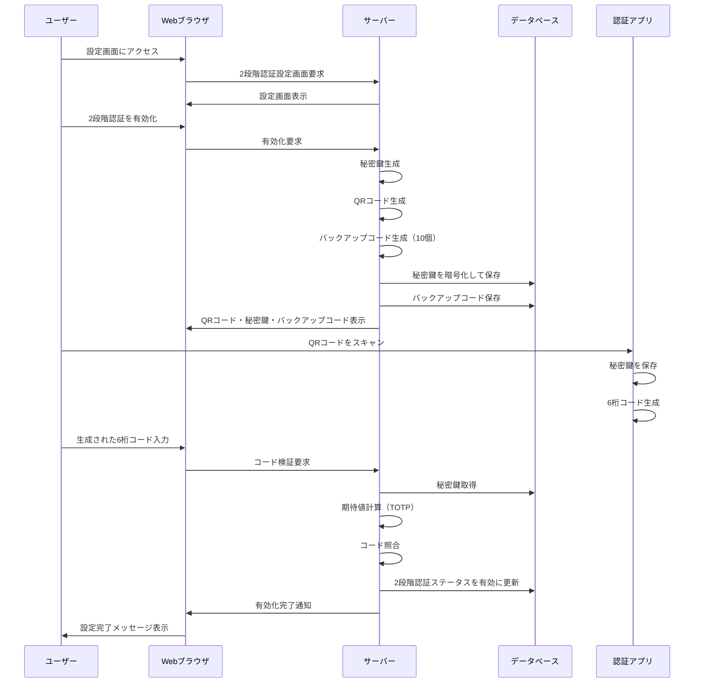
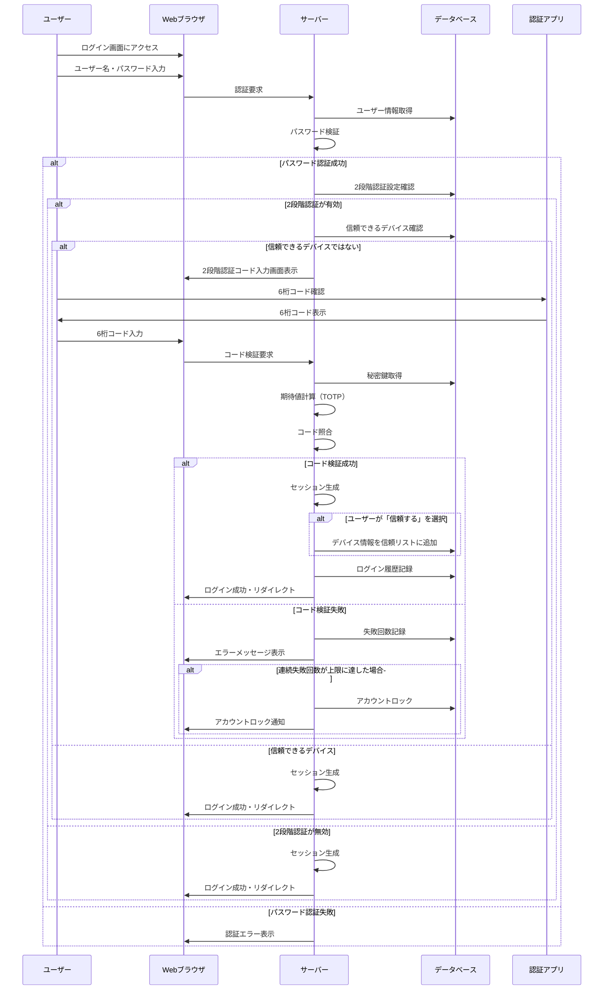
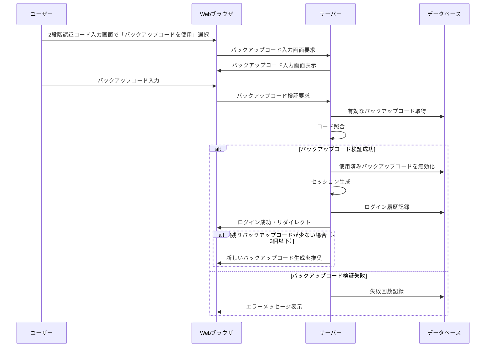
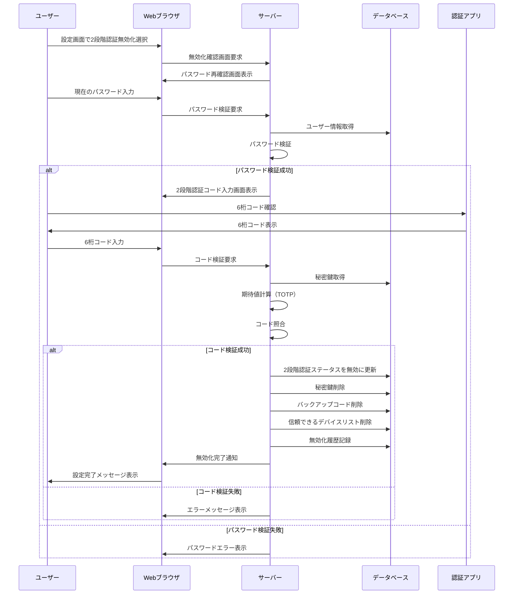
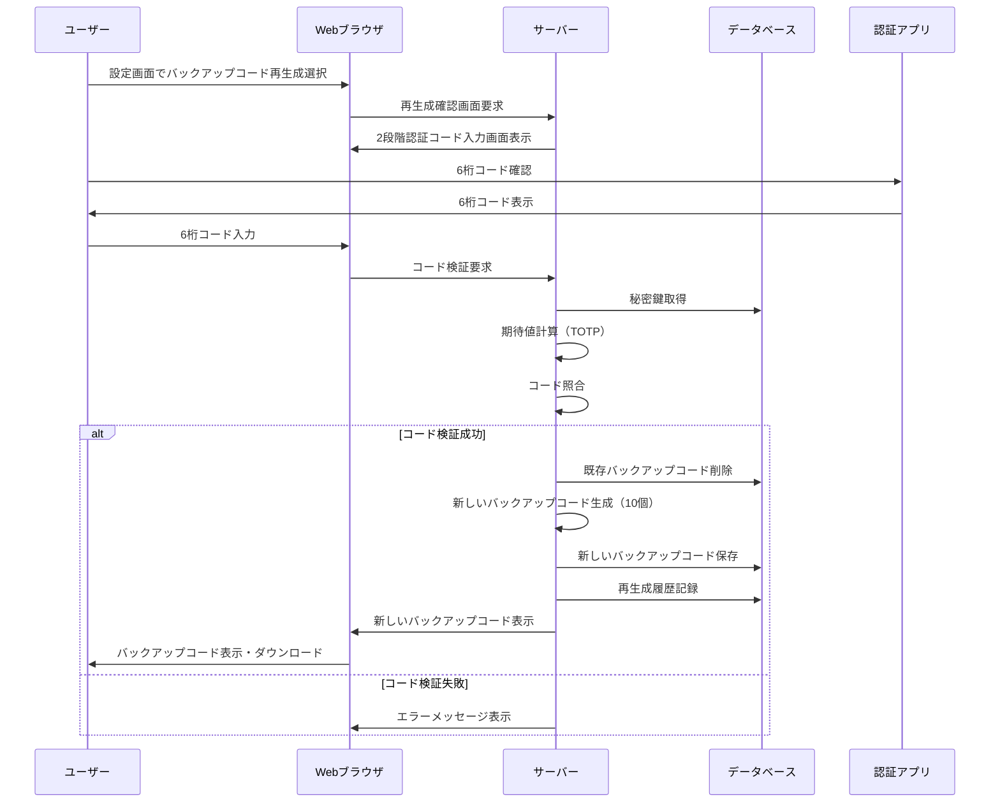
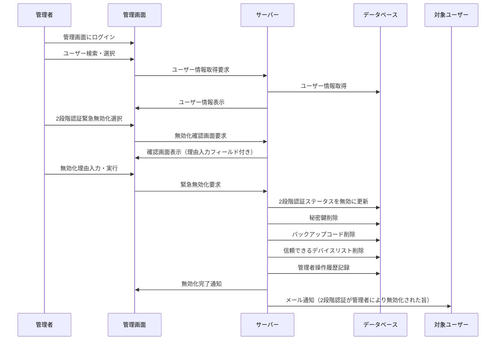

# 2段階認証機能 シーケンス図

## 1. 2段階認証有効化フロー

```mermaid
sequenceDiagram
    participant U as ユーザー
    participant W as Webブラウザ
    participant S as サーバー
    participant DB as データベース
    participant A as 認証アプリ

    U->>W: 設定画面にアクセス
    W->>S: 2段階認証設定画面要求
    S->>W: 設定画面表示
    
    U->>W: 2段階認証を有効化
    W->>S: 有効化要求
    S->>S: 秘密鍵生成
    S->>S: QRコード生成
    S->>S: バックアップコード生成（10個）
    S->>DB: 秘密鍵を暗号化して保存
    S->>DB: バックアップコード保存
    S->>W: QRコード・秘密鍵・バックアップコード表示
    
    U->>A: QRコードをスキャン
    A->>A: 秘密鍵を保存
    A->>A: 6桁コード生成
    
    U->>W: 生成された6桁コード入力
    W->>S: コード検証要求
    S->>DB: 秘密鍵取得
    S->>S: 期待値計算（TOTP）
    S->>S: コード照合
    S->>DB: 2段階認証ステータスを有効に更新
    S->>W: 有効化完了通知
    W->>U: 設定完了メッセージ表示
```

## 2. 2段階認証ログインフロー

```mermaid
sequenceDiagram
    participant U as ユーザー
    participant W as Webブラウザ
    participant S as サーバー
    participant DB as データベース
    participant A as 認証アプリ

    U->>W: ログイン画面にアクセス
    U->>W: ユーザー名・パスワード入力
    W->>S: 認証要求
    S->>DB: ユーザー情報取得
    S->>S: パスワード検証
    
    alt パスワード認証成功
        S->>DB: 2段階認証設定確認
        alt 2段階認証が有効
            S->>DB: 信頼できるデバイス確認
            alt 信頼できるデバイスではない
                S->>W: 2段階認証コード入力画面表示
                
                U->>A: 6桁コード確認
                A->>U: 6桁コード表示
                U->>W: 6桁コード入力
                W->>S: コード検証要求
                
                S->>DB: 秘密鍵取得
                S->>S: 期待値計算（TOTP）
                S->>S: コード照合
                
                alt コード検証成功
                    S->>S: セッション生成
                    alt ユーザーが「信頼する」を選択
                        S->>DB: デバイス情報を信頼リストに追加
                    end
                    S->>DB: ログイン履歴記録
                    S->>W: ログイン成功・リダイレクト
                else コード検証失敗
                    S->>DB: 失敗回数記録
                    S->>W: エラーメッセージ表示
                    alt 連続失敗回数が上限に達した場合
                        S->>DB: アカウントロック
                        S->>W: アカウントロック通知
                    end
                end
            else 信頼できるデバイス
                S->>S: セッション生成
                S->>W: ログイン成功・リダイレクト
            end
        else 2段階認証が無効
            S->>S: セッション生成
            S->>W: ログイン成功・リダイレクト
        end
    else パスワード認証失敗
        S->>W: 認証エラー表示
    end
```

## 3. バックアップコード使用フロー

```mermaid
sequenceDiagram
    participant U as ユーザー
    participant W as Webブラウザ
    participant S as サーバー
    participant DB as データベース

    U->>W: 2段階認証コード入力画面で「バックアップコードを使用」選択
    W->>S: バックアップコード入力画面要求
    S->>W: バックアップコード入力画面表示
    
    U->>W: バックアップコード入力
    W->>S: バックアップコード検証要求
    S->>DB: 有効なバックアップコード取得
    S->>S: コード照合
    
    alt バックアップコード検証成功
        S->>DB: 使用済みバックアップコードを無効化
        S->>S: セッション生成
        S->>DB: ログイン履歴記録
        S->>W: ログイン成功・リダイレクト
        
        alt 残りバックアップコードが少ない場合（3個以下）
            S->>W: 新しいバックアップコード生成を推奨
        end
    else バックアップコード検証失敗
        S->>DB: 失敗回数記録
        S->>W: エラーメッセージ表示
    end
```

## 4. 2段階認証無効化フロー

```mermaid
sequenceDiagram
    participant U as ユーザー
    participant W as Webブラウザ
    participant S as サーバー
    participant DB as データベース
    participant A as 認証アプリ

    U->>W: 設定画面で2段階認証無効化選択
    W->>S: 無効化確認画面要求
    S->>W: パスワード再確認画面表示
    
    U->>W: 現在のパスワード入力
    W->>S: パスワード検証要求
    S->>DB: ユーザー情報取得
    S->>S: パスワード検証
    
    alt パスワード検証成功
        S->>W: 2段階認証コード入力画面表示
        
        U->>A: 6桁コード確認
        A->>U: 6桁コード表示
        U->>W: 6桁コード入力
        W->>S: コード検証要求
        
        S->>DB: 秘密鍵取得
        S->>S: 期待値計算（TOTP）
        S->>S: コード照合
        
        alt コード検証成功
            S->>DB: 2段階認証ステータスを無効に更新
            S->>DB: 秘密鍵削除
            S->>DB: バックアップコード削除
            S->>DB: 信頼できるデバイスリスト削除
            S->>DB: 無効化履歴記録
            S->>W: 無効化完了通知
            W->>U: 設定完了メッセージ表示
        else コード検証失敗
            S->>W: エラーメッセージ表示
        end
    else パスワード検証失敗
        S->>W: パスワードエラー表示
    end
```

## 5. バックアップコード再生成フロー

```mermaid
sequenceDiagram
    participant U as ユーザー
    participant W as Webブラウザ
    participant S as サーバー
    participant DB as データベース
    participant A as 認証アプリ

    U->>W: 設定画面でバックアップコード再生成選択
    W->>S: 再生成確認画面要求
    S->>W: 2段階認証コード入力画面表示
    
    U->>A: 6桁コード確認
    A->>U: 6桁コード表示
    U->>W: 6桁コード入力
    W->>S: コード検証要求
    
    S->>DB: 秘密鍵取得
    S->>S: 期待値計算（TOTP）
    S->>S: コード照合
    
    alt コード検証成功
        S->>DB: 既存バックアップコード削除
        S->>S: 新しいバックアップコード生成（10個）
        S->>DB: 新しいバックアップコード保存
        S->>DB: 再生成履歴記録
        S->>W: 新しいバックアップコード表示
        W->>U: バックアップコード表示・ダウンロード
    else コード検証失敗
        S->>W: エラーメッセージ表示
    end
```

## 6. 管理者による緊急無効化フロー

```mermaid
sequenceDiagram
    participant A as 管理者
    participant AW as 管理画面
    participant S as サーバー
    participant DB as データベース
    participant U as 対象ユーザー

    A->>AW: 管理画面にログイン
    A->>AW: ユーザー検索・選択
    AW->>S: ユーザー情報取得要求
    S->>DB: ユーザー情報取得
    S->>AW: ユーザー情報表示
    
    A->>AW: 2段階認証緊急無効化選択
    AW->>S: 無効化確認画面要求
    S->>AW: 確認画面表示（理由入力フィールド付き）
    
    A->>AW: 無効化理由入力・実行
    AW->>S: 緊急無効化要求
    S->>DB: 2段階認証ステータスを無効に更新
    S->>DB: 秘密鍵削除
    S->>DB: バックアップコード削除
    S->>DB: 信頼できるデバイスリスト削除
    S->>DB: 管理者操作履歴記録
    S->>AW: 無効化完了通知
    
    S->>U: メール通知（2段階認証が管理者により無効化された旨）
```