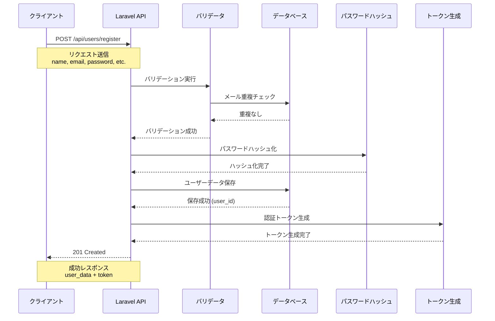
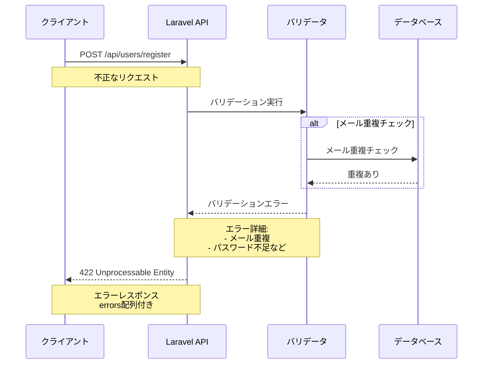
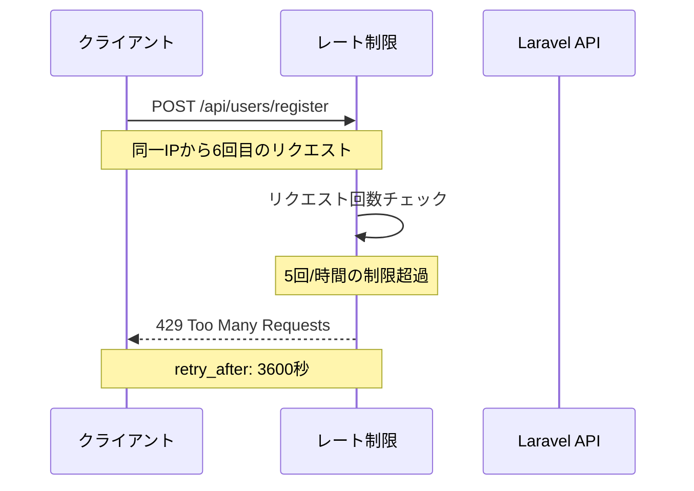
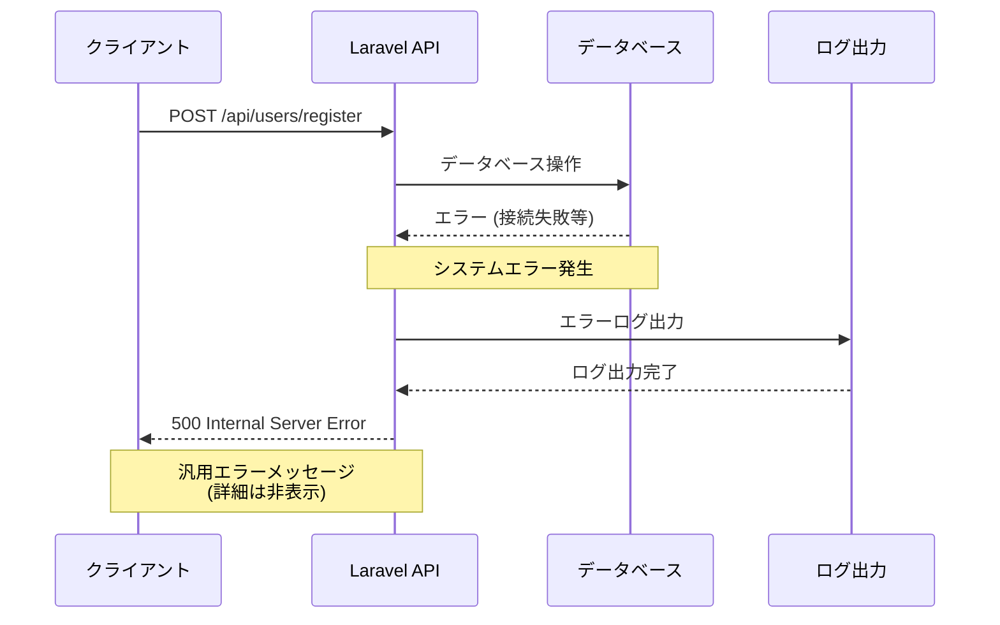

# 【ツール】API定義書_Laravel_ユーザー登録

## 1. API基本情報

| 項目 | 内容 |
|------|------|
| API名 | ユーザー登録API |
| システム名 | Laravel Webアプリケーション |
| 作成日 | 2025-08-19 |
| 作成者 | Claude Code |
| バージョン | 1.0 |
| 更新日 |  |

## 2. API概要

### 2.1 目的
新規ユーザーアカウントの作成を行う

### 2.2 機能概要
- ユーザー情報の登録
- バリデーション処理
- パスワードの暗号化
- 認証トークンの発行
- メールアドレス重複チェック

## 3. API仕様

### 3.1 基本仕様

| 項目 | 内容 |
|------|------|
| HTTP Method | POST |
| URL | /api/users/register |
| Content-Type | application/json |
| 認証 | 不要 |
| レート制限 | 5回/時間（同一IP） |

### 3.2 リクエストパラメータ

| パラメータ名 | 型 | 必須 | 制約 | 説明 | 例 |
|-------------|----|----|------|------|-----|
| name | string | ✓ | max:255 | ユーザー名 | "山田太郎" |
| email | string | ✓ | email形式, unique, max:255 | メールアドレス | "yamada@example.com" |
| password | string | ✓ | min:8, confirmed | パスワード | "password123" |
| password_confirmation | string | ✓ | same:password | パスワード確認 | "password123" |
| phone | string |  | max:20 | 電話番号 | "090-1234-5678" |
| terms_accepted | boolean | ✓ | accepted (true必須) | 利用規約同意 | true |

### 3.3 Laravelバリデーションルール

```php
[
    'name' => 'required|string|max:255',
    'email' => 'required|email|unique:users,email|max:255',
    'password' => 'required|string|min:8|confirmed',
    'password_confirmation' => 'required|same:password',
    'phone' => 'nullable|string|max:20',
    'terms_accepted' => 'required|accepted'
]
```

## 4. レスポンス仕様

### 4.1 成功時レスポンス（201 Created）

```json
{
    "success": true,
    "message": "ユーザー登録が完了しました",
    "data": {
        "id": 1,
        "name": "山田太郎",
        "email": "yamada@example.com",
        "phone": "090-1234-5678",
        "email_verified_at": null,
        "created_at": "2025-08-19T12:00:00.000000Z",
        "updated_at": "2025-08-19T12:00:00.000000Z"
    },
    "token": {
        "type": "Bearer",
        "access_token": "1|abcdef123456789...",
        "expires_at": "2025-08-20T12:00:00.000000Z"
    }
}
```

### 4.2 バリデーションエラー（422 Unprocessable Entity）

```json
{
    "success": false,
    "message": "入力データに誤りがあります",
    "errors": {
        "email": [
            "このメールアドレスは既に使用されています"
        ],
        "password": [
            "パスワードは8文字以上である必要があります"
        ],
        "terms_accepted": [
            "利用規約への同意が必要です"
        ]
    }
}
```

### 4.3 レート制限エラー（429 Too Many Requests）

```json
{
    "success": false,
    "message": "リクエスト回数が上限に達しました。しばらく時間をおいて再試行してください",
    "retry_after": 3600
}
```

### 4.4 サーバーエラー（500 Internal Server Error）

```json
{
    "success": false,
    "message": "サーバーエラーが発生しました",
    "errors": {}
}
```

## 5. HTTPステータスコード一覧

| コード | 説明 | 発生条件 |
|--------|------|----------|
| 201 | Created | ユーザー登録成功 |
| 422 | Unprocessable Entity | バリデーションエラー |
| 429 | Too Many Requests | レート制限超過 |
| 500 | Internal Server Error | システムエラー |

## 6. エラーメッセージ詳細

### 6.1 バリデーションエラーメッセージ

| 項目 | エラーメッセージ |
|------|----------------|
| name | 名前は必須です / 名前は255文字以下で入力してください |
| email | メールアドレスは必須です / 正しいメールアドレス形式で入力してください / このメールアドレスは既に使用されています |
| password | パスワードは必須です / パスワードは8文字以上で入力してください |
| password_confirmation | パスワード確認は必須です / パスワードが一致しません |
| phone | 電話番号は20文字以下で入力してください |
| terms_accepted | 利用規約への同意が必要です |

## 7. 実装時の考慮事項

### 7.1 セキュリティ対策
- パスワードのbcryptハッシュ化
- CSRFトークン検証
- SQL インジェクション対策
- XSS対策

### 7.2 データベース設計
- usersテーブルのemailカラムにユニークインデックス
- パスワードカラムの適切な長さ設定
- 作成日時・更新日時の自動設定

### 7.3 ログ出力
- 登録成功ログ
- バリデーションエラーログ
- システムエラーログ（機密情報除く）

## 8. テストケース

### 8.1 正常系テスト
- [ ] 必須項目すべて正常値での登録
- [ ] 電話番号なしでの登録
- [ ] 認証トークン発行確認

### 8.2 異常系テスト
- [ ] 必須項目未入力
- [ ] メールアドレス重複
- [ ] パスワード不一致
- [ ] 利用規約未同意
- [ ] 不正な文字数制限

### 8.3 境界値テスト
- [ ] 名前255文字
- [ ] パスワード8文字
- [ ] 電話番号20文字

## 9. 処理シーケンス図

### 9.1 正常系シーケンス図



### 9.2 バリデーションエラー時シーケンス図



### 9.3 レート制限エラー時シーケンス図



### 9.4 システムエラー時シーケンス図



## 10. 運用時の監視項目
- 登録成功率
- エラー発生率
- レスポンス時間
- レート制限到達回数

---

**備考**
- 本仕様書はLaravel 9.x以上を想定
- 実装前にセキュリティレビューを実施すること
- API仕様変更時は本書を更新すること